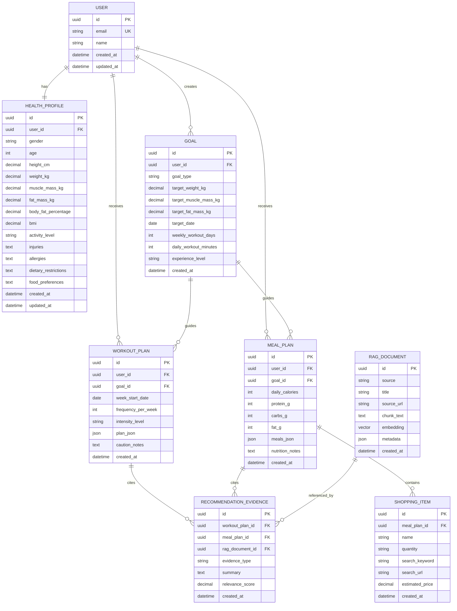

# ERD

FitRAG Coach MVP의 핵심 데이터 모델과 관계를 정의한다.

## 1. 핵심 엔티티

### User

- 사용자 계정 기본 정보
- 이메일, 이름, 생성일을 관리한다.

### HealthProfile

- 사용자의 신체 정보와 건강 관련 입력값을 관리한다.
- User와 1:1 관계를 갖는다.

### Goal

- 사용자의 목표 유형과 목표 수치를 관리한다.
- User와 1:N 관계를 갖는다.

### WorkoutPlan

- 생성된 주간 운동 계획을 저장한다.
- User, Goal과 연결된다.

### MealPlan

- 생성된 식단 계획과 식재료 리스트를 저장한다.
- User, Goal과 연결된다.

### ShoppingItem

- 식단 실행에 필요한 식재료와 검색 URL을 저장한다.
- MealPlan과 1:N 관계를 갖는다.

### RagDocument

- RAG 검색에 사용하는 원천 문서와 청크 정보를 저장한다.

### RecommendationEvidence

- 추천 결과와 근거 문서의 연결 정보를 저장한다.

## 2. 관계 요약

- User 1:1 HealthProfile
- User 1:N Goal
- User 1:N WorkoutPlan
- User 1:N MealPlan
- Goal 1:N WorkoutPlan
- Goal 1:N MealPlan
- MealPlan 1:N ShoppingItem
- WorkoutPlan N:M RagDocument via RecommendationEvidence
- MealPlan N:M RagDocument via RecommendationEvidence

## 3. Mermaid ERD

## 4. 설계 메모

- `plan_json`과 `meals_json`은 MVP 단계에서 빠른 반복을 위해 JSON으로 저장한다.
- 추천 결과 검색과 통계를 강화할 시 `WorkoutDay`, `WorkoutExercise`, `Meal`, `MealFood` 테이블로 정규화한다.
- `RecommendationEvidence`는 운동 계획과 식단 계획 중 하나에 연결될 수 있다.
- `RagDocument.embedding`은 Chroma 또는 FAISS를 사용할 경우 애플리케이션 DB에는 메타데이터만 저장할 수 있다.